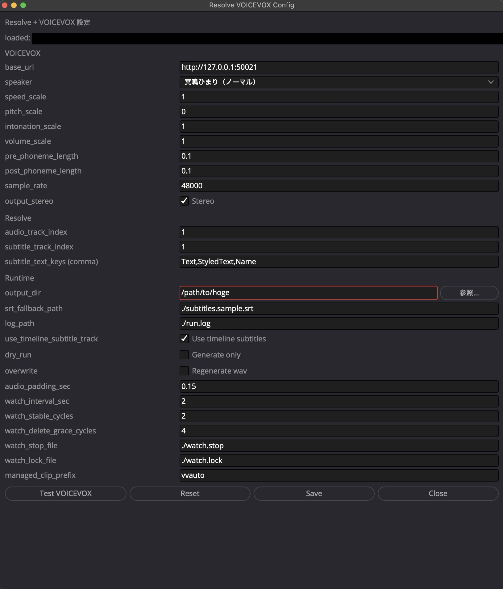

# Resolve + VOICEVOX Auto

DaVinci Resolve の字幕を元に VOICEVOX で音声を生成し、タイムラインの指定オーディオトラックへ自動配置する Lua スクリプトです。

## Features

- Resolve 内で完結する Lua 実装
- 字幕トラックからテキストを取得して WAV を自動生成
- 監視モードで字幕の追加・変更・削除に追従
- GUI で `config.data` を編集・保存（スクリプトメニューには表示されません）

## Repository Structure

- `src/main.lua` : 一括実行
- `src/auto_watch.lua` : 監視実行（疑似リアルタイム）
- `src/stop_watch.lua` : 監視停止
- `src/config.lua` : 設定GUI
- `src/config.data` : 設定ファイル
- `src/subtitles.sample.srt` : SRTサンプル（`runtime.srt_fallback_path` の動作確認用）
- `scripts/install_resolve_lua.sh` : Resolve 用ディレクトリへコピー（`config.data` の挙動を引数指定可）
- `scripts/uninstall_resolve_lua.sh` : Resolve 用ディレクトリからアンインストール

## Requirements

- macOS
- DaVinci Resolve
- VOICEVOX Engine（ネイティブ起動 or Docker）

## 動作確認環境

- macOS 23.3
- DaVinci Resolve 20.3.2

## Quick Start

1. リポジトリを clone

```bash
git clone <your-repository-url>
cd <repository-directory>
```

2. Resolve Scripts 配下へコピー

```bash
./scripts/install_resolve_lua.sh
```

`config.data` の扱いを指定する場合:

```bash
# 既定: keep（既存 config.data を保持）
./scripts/install_resolve_lua.sh --config-policy keep

# workspace(src/config.data) を target へ上書き
./scripts/install_resolve_lua.sh --config-policy push

# target/config.data を workspace に取り込んでから配置
./scripts/install_resolve_lua.sh --config-policy pull
```

3. DaVinci Resolve で実行

   **最初に必ず `config.lua` を開いて `output_dir` を設定・保存してください。**
   `output_dir` が未設定のままスクリプトを実行するとエラーになります。

   - `Workspace > Scripts > Utility > resolve_voicevox_auto > config.lua` を開く
   - `output_dir` に **既存のフォルダ** を絶対パスで指定する（例: `/Users/you/Movies`）
     - 指定したフォルダの中に `voicevox/` が自動作成され、そこに WAV が保存されます
     - 指定したフォルダ自体が存在しない場合はエラーになります（自動作成しません）
   - 「保存」ボタンで `config.data` に保存する

   

   - 一括実行: `main.lua`
   - 監視開始: `auto_watch.lua`
   - 監視停止: `stop_watch.lua`

## Uninstall

Resolve Scripts 配下から削除する場合:

```bash
./scripts/uninstall_resolve_lua.sh
```

カスタム配置先を指定した場合:

```bash
./scripts/uninstall_resolve_lua.sh "/path/to/resolve_voicevox_auto"
```

## Configuration

設定は `src/config.data` で管理します（通常は `config.lua` から編集）。主な項目:

- `voicevox.base_url`: VOICEVOX Engine URL
- `voicevox.speaker_id`: 話者ID
- `resolve.audio_track_index`: 配置先オーディオトラック
- `resolve.subtitle_track_index`: 取得元字幕トラック
- `runtime.output_dir`: WAV の保存先親フォルダ（**必須**）。既存のフォルダを絶対パスで指定してください（例: `/Users/you/Movies`）。指定フォルダ内に `voicevox/` を自動作成して WAV を保存します。未設定または存在しないパスを指定した場合はエラーになります。
- `runtime.srt_fallback_path`: 字幕取得不可時のSRTパス
- `runtime.watch_interval_sec`: 監視間隔（秒）
- `runtime.managed_clip_prefix`: 自動管理クリップ識別子

## Notes

- 生成音声は `{output_dir}/voicevox/` フォルダに保存されます。`output_dir` には存在する親フォルダを指定してください（自動作成しません）。
- Resolve API のバージョン差で字幕テキスト取得が不安定な場合、`runtime.srt_fallback_path` を利用してください。
- 監視モードは単一起動で使用してください（ロックファイルで多重起動を防止）。
- `main.lua` / `auto_watch.lua` 実行時は VOICEVOX Docker (`voicevox_engine`) を自動起動します。
- 実行終了時に、その実行で起動したコンテナは自動停止します。
- さらに Resolve 終了を監視するガードを起動し、Resolve終了時にもコンテナ停止を試みます。

## Troubleshooting

- VOICEVOX に接続できない場合:
  - `curl -sS http://127.0.0.1:50021/version` が返ることを確認
- Resolve API へ接続できない場合:
  - Resolve 起動中に実行
  - Resolve の External Scripting 設定を確認

## License

MIT License
