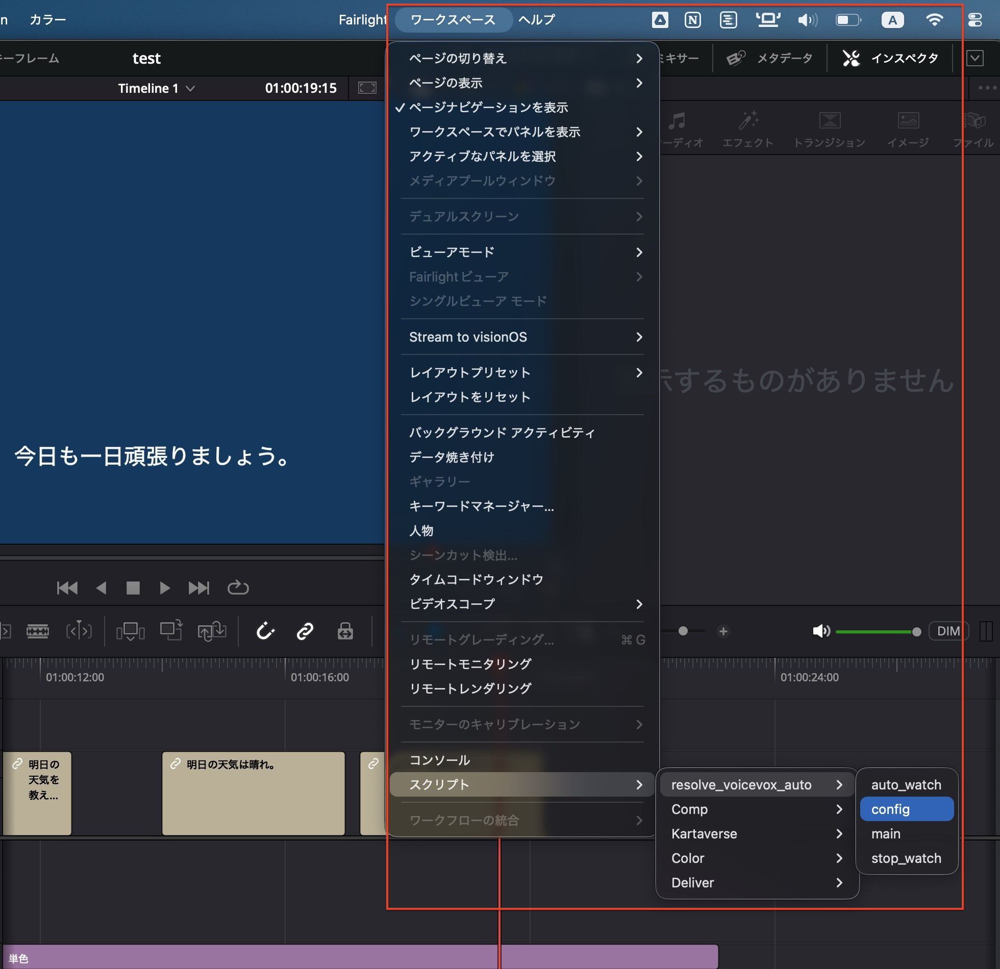
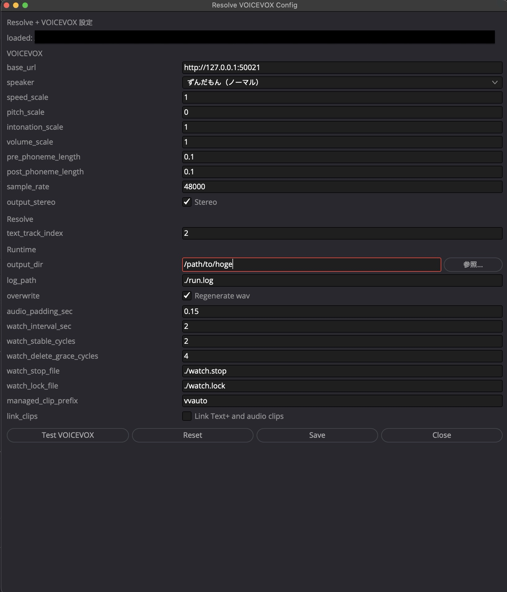

# Resolve + VOICEVOX Auto

DaVinci Resolve のビデオトラックに配置した **Text+** クリップのテキストを元に VOICEVOX で音声を生成し、タイムラインの指定オーディオトラックへ自動配置する Lua スクリプトです。

## Features

- Resolve 内で完結する Lua 実装
- ビデオトラック上の **Text+** クリップからテキストを取得して WAV を自動生成
- 監視モードで Text+ クリップの追加・変更・削除に追従（テキスト変更時は旧音声を即座に置換）
- `main.lua` 実行中は「処理中 N / M」プログレスウィンドウを表示
- 生成音声はメディアプールの **voicevox** ビンに自動整理（ルート直下に一度だけ作成）
- GUI で `config.data` を編集・保存（スクリプトメニューには表示されません）

> **注意**: プレーンな「テキスト」ジェネレーターは DaVinci Resolve の API 制限によりテキストを読み取れません。必ず **Text+** クリップを使用してください。

## Repository Structure

- `src/main.lua` : 一括実行
- `src/auto_watch.lua` : 監視実行（疑似リアルタイム）
- `src/stop_watch.lua` : 監視停止
- `src/config.lua` : 設定GUI
- `src/config.data` : 設定ファイル
- `scripts/install_resolve_lua.sh` : Resolve 用ディレクトリへコピー（`config.data` の挙動を引数指定可）
- `scripts/uninstall_resolve_lua.sh` : Resolve 用ディレクトリからアンインストール

## Requirements

- macOS
- DaVinci Resolve
- VOICEVOX Engine（ネイティブ起動 or Docker）

## 動作確認環境

- macOS 23.3
- DaVinci Resolve 20.3.2

## Quick Start

1. リポジトリを clone

```bash
git clone <your-repository-url>
cd <repository-directory>
```

2. Resolve Scripts 配下へコピー

```bash
./scripts/install_resolve_lua.sh
```

`config.data` の扱いを指定する場合:

```bash
# 既定: keep（既存 config.data を保持）
./scripts/install_resolve_lua.sh --config-policy keep

# workspace(src/config.data) を target へ上書き
./scripts/install_resolve_lua.sh --config-policy push

# target/config.data を workspace に取り込んでから配置
./scripts/install_resolve_lua.sh --config-policy pull
```

3. DaVinci Resolve で実行

   **最初に必ず `config.lua` を開いて `output_dir` を設定・保存してください。**
   `output_dir` が未設定のままスクリプトを実行するとエラーになります。

   - `Workspace > Scripts > Utility > resolve_voicevox_auto > config.lua` を開く

   

   - `output_dir` に **既存のフォルダ** を絶対パスで指定する（例: `/Users/you/Movies/voice`）
     - 指定したフォルダへ直接 WAV が保存されます
   - 「保存」ボタンで `config.data` に保存する

   

   - ビデオトラックに **Text+** クリップを配置し、合成したいテキストを入力する
     - `text_track_index` で読み取るビデオトラック番号を指定（デフォルト: 1）
     - プレーンな「テキスト」ジェネレーターは API 制限のため非対応
   - 一括実行: `main.lua`（実行中は「処理中 N / M」ウィンドウを表示、完了後に自動閉じる）
   - 監視開始: `auto_watch.lua`
   - 監視停止: `stop_watch.lua`

## Uninstall

Resolve Scripts 配下から削除する場合:

```bash
./scripts/uninstall_resolve_lua.sh
```

カスタム配置先を指定した場合:

```bash
./scripts/uninstall_resolve_lua.sh "/path/to/resolve_voicevox_auto"
```

## Configuration

設定は `src/config.data` で管理します（通常は `config.lua` から編集）。

詳細は [docs/config.md](docs/config.md) を参照してください。

## Notes

- 生成音声は `output_dir` に指定したフォルダへ直接保存されます。存在するフォルダを絶対パスで指定してください（自動作成しません）。
- メディアプール内にルート直下の **voicevox** ビンを自動作成し、生成音声をまとめます。再起動後もネストは発生しません。
- 対応するクリップは **Text+** のみです。プレーンな「テキスト」ジェネレーターは DaVinci Resolve のスクリプト API 制限によりテキストを読み取れないため非対応です。
- `overwrite = false`（デフォルト）なら変更したセグメントのみ再合成できません。テキストを編集した場合は `overwrite = true` にして `main.lua` を実行するか、`auto_watch.lua` を使用してください。
- 監視モードは単一起動で使用してください（ロックファイルで多重起動を防止）。
- `main.lua` / `auto_watch.lua` 実行時は VOICEVOX Docker (`voicevox/voicevox_engine:cpu-ubuntu24.04-0.26.0-dev`) をホスト port `50022` で自動起動します。
- `config.lua` を開くと Docker を非同期で起動します。起動完了後に「Test VOICEVOX」ボタンを押すとスピーカー一覧を読み込めます。
- Resolve 終了時にコンテナを自動停止します（起動済みのコンテナも対象）。

## Troubleshooting

- VOICEVOX に接続できない場合:
  - `curl -sS http://127.0.0.1:50022/version` が返ることを確認
- Resolve API へ接続できない場合:
  - Resolve 起動中に実行
  - Resolve の External Scripting 設定を確認

## License

MIT License
